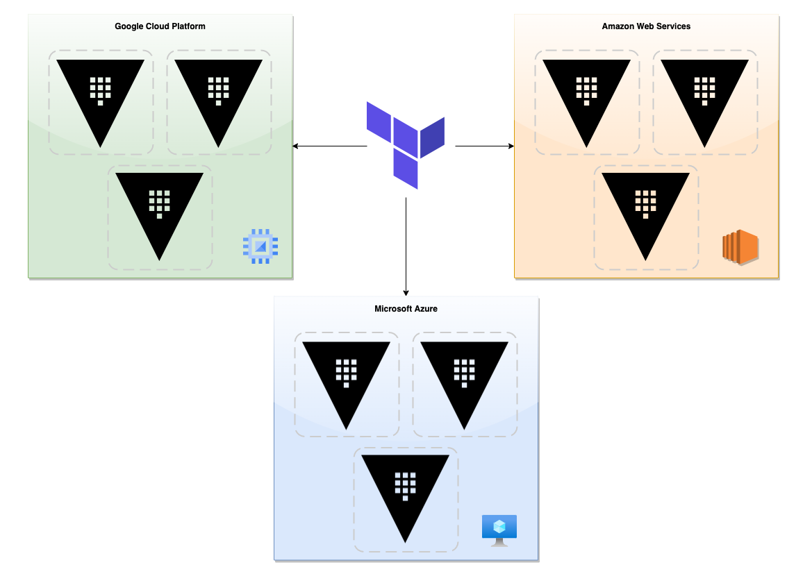
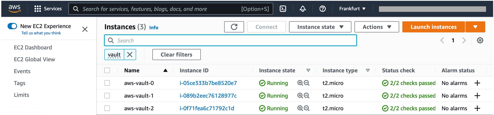
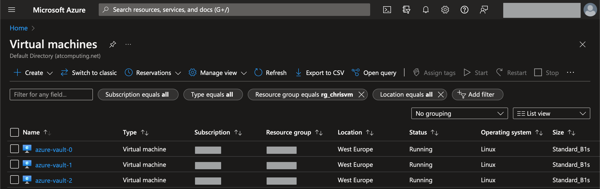
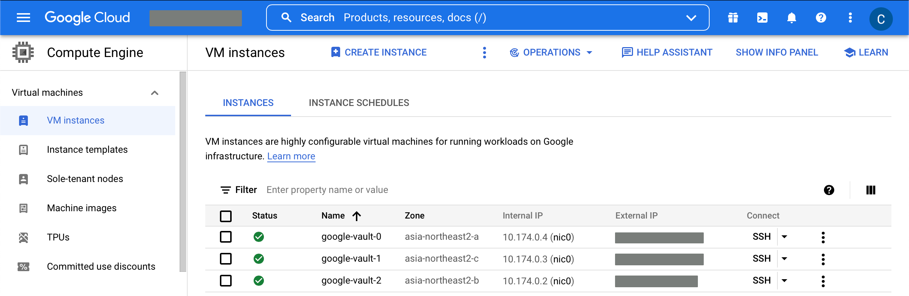
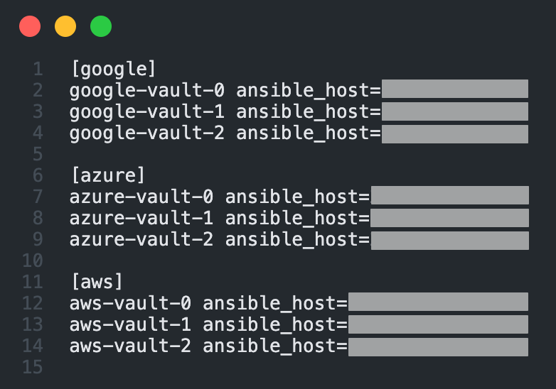
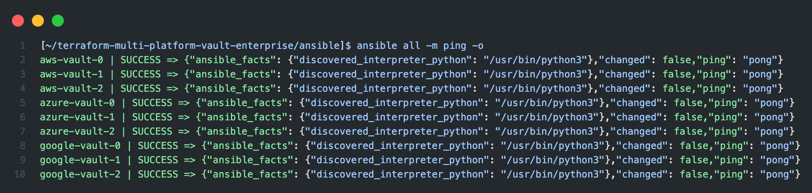
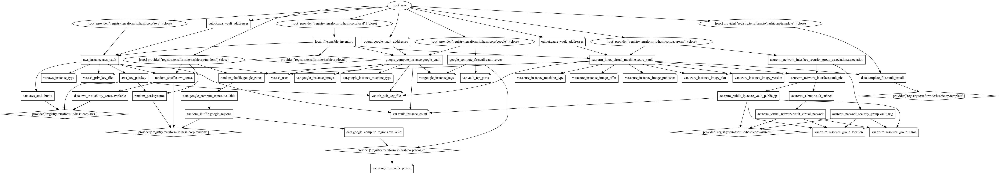

# Multi Cloud Platform + Region deployment of HashiCorp Vault Enterprise with Terraform

This idea came up while thinking of how I can prepare myself for the Vault Professional certification.  
Basically I need to be able to practice with Vault Enterprise clusters and set up replication.  
Within this setup I want to try a master/performance/disaster cluster replication setup.

So, I decided to try to accomplish the following with the rule of thirds:

- [x] Create 3 separate Vault clusters.
- [x] All 3 clusters consist of 3 Vault servers.
- [x] All 3 clusters are spread over 3 cloud providers.
  - [x] AWS
  - [x] Azure
  - [x] GCP
- [ ] Within these 3 cloud providers, all cluster nodes are automatically spread over 3 zones within one randomly chosen region.
  - [x] AWS
  - [ ] Azure
  - [x] GCP
- [x] Have ~~Terraform~~ Ansible install Vault Enterprise on these 3*3 VM instances.
  - [x] AWS
  - [x] Azure
  - [x] GCP
- [x] Have the Vault ports publicly accessible between the 3*3 VM instances.
  - [x] AWS
  - [x] Azure
  - [x] GCP
- [x] Have Terraform generate an Ansible inventory which then can be used for deployment
- [ ] Have Ansible deploy the general configuration

## Schematic overview



## Rundown

### 1. Infrastructure as Code

```shell
cd terraform
terraform init
terraform plan
terraform apply
```

### 2. Configuration management

```shell
cd ../ansible
ansible-galaxy install -r requirements.yml
ansible-playbook playbook.yml
```

## Captain's Log Stardate 100096.25

I managed to do all the thinking and scripting for one provider, in this case GCP.  
So this now can act as a sort of blueprint for the others (Azure + AWS).

I ran into some issues of when I was choosing my own region and zones, that there weren't enough resources available, so I shifted towards that Terraform would pick a random region for me and within that region choose 3 separate available zones. Of course if this was an environment that would have been deployed on a single cloud provider, one should use multiple regions as well. However, since we are doing this on multiple cloud providers, we somehow have this covered.  

And it's all for testing purposes, remember that.

## Captain's Log Stardate 100096.81

So, built the majority of the Azure functionality into the scripts.  
I still need to figure out how to spread the VM's across different zones.  
But hey, there's always room for improvement.

## Captain's Log Stardate 100097.19

AWS is also ready.  

## Captain's Log Stardate 100098.58

Woke up early today (kids...you get so much joy...) so what better way to start the day than with continuing our saga.  
So, I like Terraform, but I like Ansible even more. So now that our infrastructure is ready, I wanted to continue the configuration management with Ansible. To do this, I added a template and another Terraform resource that creates an inventory for me, that can then be used by Ansible.  

But...first I needed to re-organize the directory structure, since a whole lot of files in the root is a bit messy.  
After that I managed to get that inventory file pretty quickly and I thought it would be nice to show some screenshots of the end-state of the `terraform plan` and then the Ansible part.

### AWS Console



### Azure Console



### Google Console



### Ansible inventory file



### Ansible "hello world" by using ping



And last but not least, why don't throw in the output of `terraform graph` for some light reading...simple right?



I also created a vault role, which is 90% done I think. Need some more time to think it over and then proceed with testing.

## Captain's Log Stardate 100098.95

I decided to remove all the pre-provisioning from Terraform to keep Terraform just for the IaC and have Ansible for configuration management and have it install the binary as part of the role (with the help of my existing HashiCorp role).
