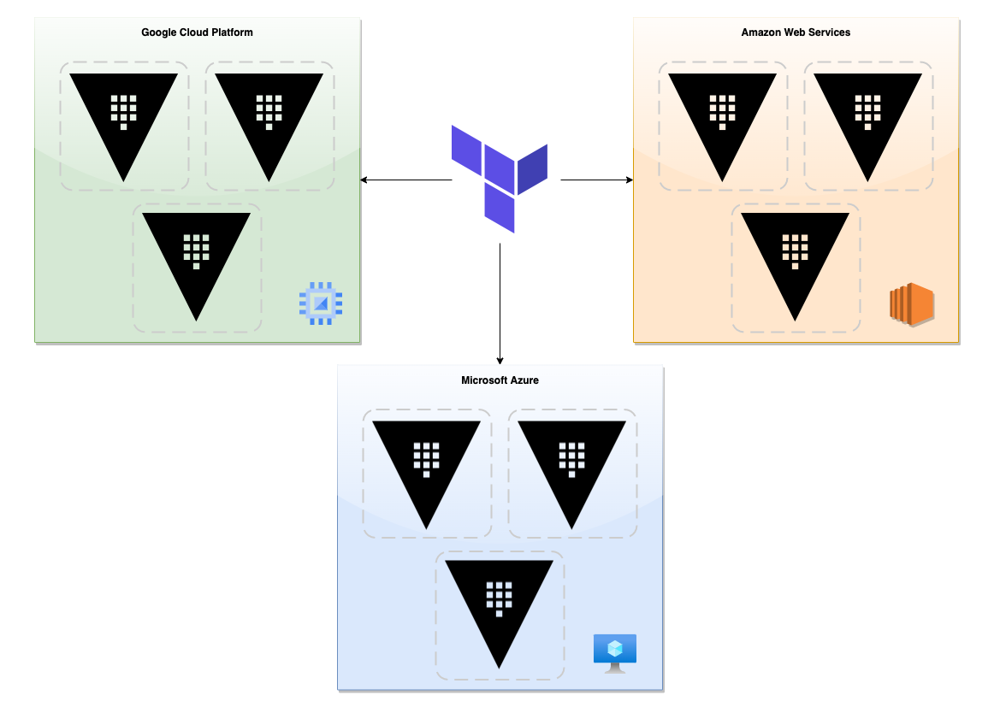

# Multi Cloud Platform + Region deployment of HashiCorp Vault Enterprise with Terraform

This idea came up while thinking of how I can prepare myself for the Vault Professional certification.  
Basically I need to be able to practice with Vault Enterprise clusters and set up replication.  
Within this setup I want to try a master/performance/disaster cluster replication setup.

So, I decided to try to accomplish the following with the rule of thirds:

- [x] Create 3 separate Vault clusters.
- [x] All 3 clusters consist of 3 Vault servers.
- [x] All 3 clusters are spread over 3 cloud providers.
  - [x] AWS
  - [x] Azure
  - [x] GCP
- [ ] Within these 3 cloud providers, all cluster nodes are automatically spread over 3 zones within one randomly chosen region.
  - [x] AWS
  - [ ] Azure
  - [x] GCP
- [x] Have Vault Enterprise installed on these 3*3 VM instances.
  - [x] AWS
  - [x] Azure
  - [x] GCP
- [x] Have the Vault ports publicly accessible between the 3*3 VM instances.
  - [x] AWS
  - [x] Azure
  - [x] GCP
- [ ] Have Ansible deploy the general configuration

## Schematic overview

## Captain's Log Stardate 100096.25

I managed to do all the thinking and scripting for one provider, in this case GCP.  
So this now can act as a sort of blueprint for the others (Azure + AWS).

I ran into some issues of when I was choosing my own region and zones, that there weren't enough resources available, so I shifted towards that Terraform would pick a random region for me and within that region choose 3 separate available zones. Of course if this was an environment that would have been deployed on a single cloud provider, one should use multiple regions as well. However, since we are doing this on multiple cloud providers, we somehow have this covered.  

And it's all for testing purposes, remember that.

## Captain's Log Stardate 100096.81

So, built the majority of the Azure functionality into the scripts.  
I still need to figure out how to spread the VM's across different zones.  
But hey, there's always room for improvement.

## Captain's Log Stardate 100097.19

AWS is also ready.  
